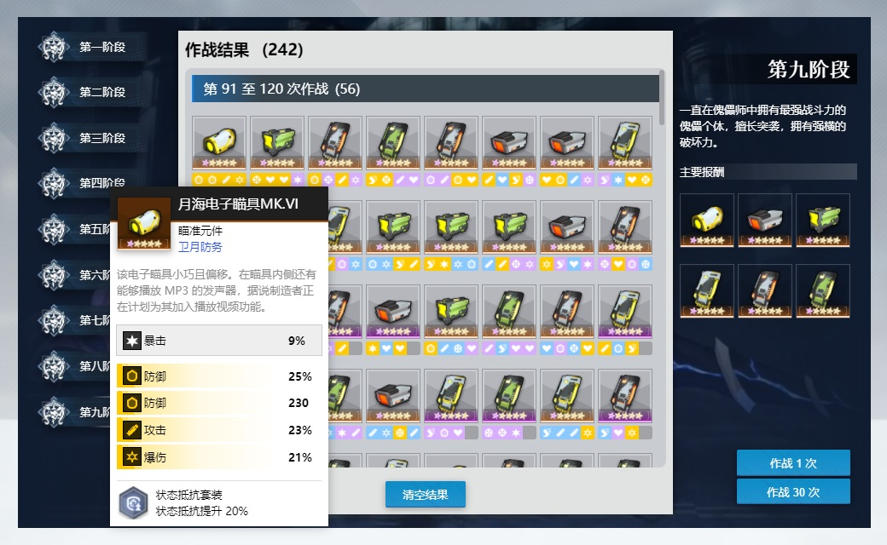
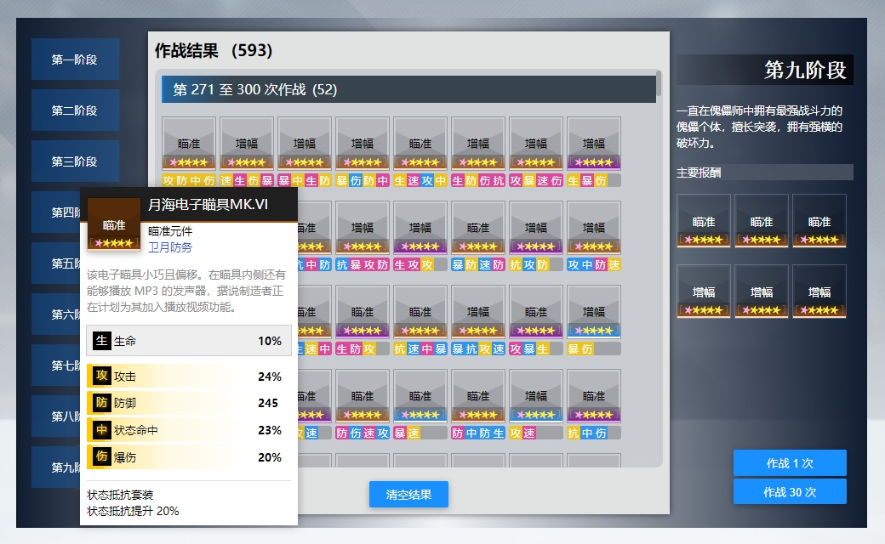

# ag-combat-simulator

一个用于模拟某手游装备副本掉落情况的网页端模拟器，源代码由 JavaScript 编写，采用中文命名标识符和文件名，基于 React 实现界面渲染和交互。

此项目受到某手游的装备本掉落机制的启发，作者因不满于该手游的装备本的高消耗低收益的现状，一时冲动就开发了具备模拟装备掉落功能的最初版本，之后时不时加一点点细节就成了现在这样。



## 目的

当然，开发此项目不仅仅是为了模拟游戏的装备本，还有以下目的：

- 体验使用 create-react-app 开发项目。
- 体验中文编程。使用中文的好处是不用浪费时间纠结用什么单词去命名，代码更简单易懂，但坏处是容易出现命名冲突，例如：名为“道具”的变量和名为“道具”的组件函数，由于中文不能像英文那样用大小写区分变量 item 和组件函数 Item，因此只能取别名。

## 开发

先克隆此代码库到本地，然后运行以下命令：

```bash
cd ag-combat-simulator
yarn install
yarn start
```

## 许可

本项目基于 AGPL 许可协议开源，任何能访问该项目页面的人都能获取项目源码。

## 注意事项

本项目主要用于技术人员的技术研究、学习和交流，以及玩家对游戏机制的模拟体验。

出于提升装备辨识度、贴近游戏界面风格和改善视觉体验的目的，本项目使用了从游戏资源文件中提取的图片资源，主要包括：装备图片、属性图标、关卡界面图片，除此之外，还使用了来自屏幕录像工具截取的 BOSS 界面动画。

为了避免因这些资源而产生的不必要的麻烦，本项目所公开的文件中不包括这些资源文件，在部署的站点中所使用的图片资源是经工具打包合并后的资源。若游戏版权方有要求，此项目的站点将会移除全部图片资源，移除后的效果如下图所示。


